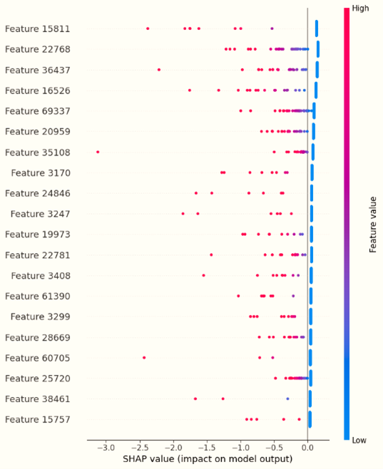

# 🧠 Explainable AI for Detecting Mental Health Conditionb

This project presents a complete pipeline involving data exploration, machine learning, deep learning, and explainable AI techniques to build interpretable models for classification tasks.

---

## 📂 Project Structure

| File Name                         | Description                                                |
|-----------------------------------|------------------------------------------------------------|
| `Exploratory_Data_Analysis.ipynb` | Data loading, visualization, and preprocessing             |
| `Machine_Learning_AI.ipynb`       | Trains and evaluates classical ML models like RF, LR, etc. |
| `Deep_Learning_AI (1).ipynb`      | Builds and tests deep learning models (CNN, LSTM, BiGRU)   |

---

## ✅ Features

- 📊 Exploratory Data Analysis (EDA)
- 🧪 Traditional ML Models (Random Forest, Logistic Regression, etc.)
- 🤖 Deep Learning Models (CNN, LSTM, BiGRU)
- 📈 Performance Metrics (accuracy, precision, recall, F1-score)
- 🧾 (Optional) XAI support using SHAP, LIME, etc.

---

## 🚀 Getting Started

### 1. Clone the Repository

git clone https://github.com/Bijoy781999/Explainable-AI-for-Detecting-Mental-Health-Condition.git
cd ai-xai-project

### 2. Install Dependencies
- pip install numpy pandas matplotlib seaborn scikit-learn shap tensorflow keras

### 3. Run the Scripts
- python exploratory_data_analysis.py       # Step 1: Understand the data
- python Machine_Learning_AI.py             # Step 2: Run ML models
- python "deep_learning_ai (1).py"          # Step 3: Run deep learning models

---

## 🛠️ Tech Stack
- Python 3.x
- NumPy, Pandas
- Matplotlib, Seaborn
- Scikit-learn
- TensorFlow / Keras
- SHAP (for explainability)

---

## OutPuts

