<div align="center"> 
<h1 align="center"> 
  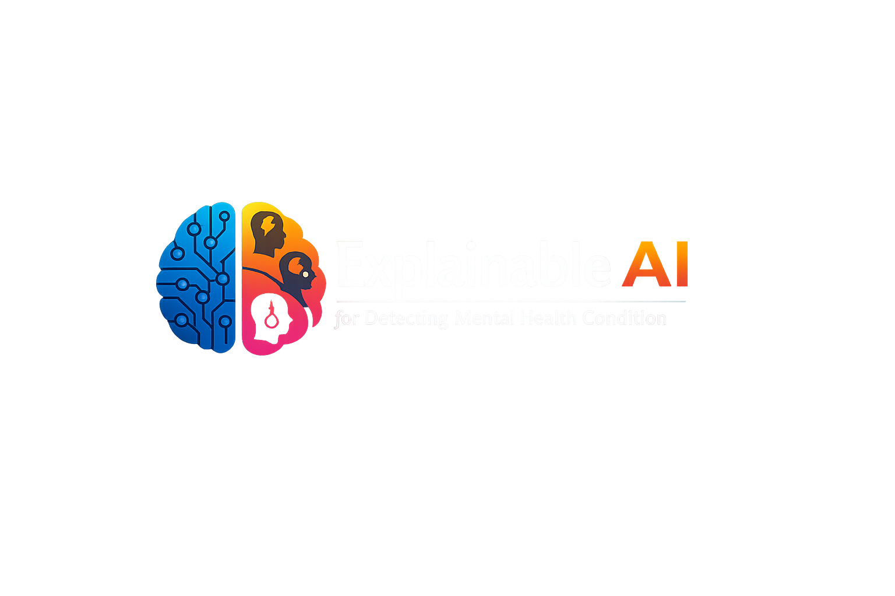Explainable AI for Detecting Mental Health Condition
 </h1>

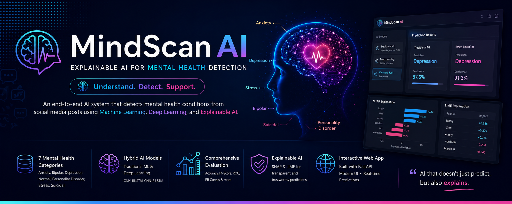

<br>

### *An Explainable Artificial Intelligence Framework for Multi-Class Mental Health Detection from Social Media Posts using Machine Learning, Deep Learning, SHAP, and LIME*

<br>

[](https://www.python.org/)
[](https://www.tensorflow.org/)
[](https://scikit-learn.org/)
[](https://fastapi.tiangolo.com/)
[]
[]
[]
[]

</div>

---

## 📌 Project Description

Mental health disorders have become a major global concern, making the early identification of psychological conditions increasingly important. This project presents an **Explainable Artificial Intelligence (XAI)** framework capable of detecting multiple mental health conditions from social media posts using both **Machine Learning** and **Deep Learning** techniques.

Unlike traditional black-box models, this framework integrates **SHAP (SHapley Additive exPlanations)** and **LIME (Local Interpretable Model-agnostic Explanations)** to provide transparent and interpretable predictions, enabling users to understand **why** a particular mental health condition is predicted.

The project also includes a modern **FastAPI-powered web application** that allows users to analyze text, compare predictions from Machine Learning and Deep Learning models, and visualize model explanations through an intuitive interface.

---

# ✨ Key Features

- 🧠 Multi-Class Mental Health Detection
- 🤖 Traditional Machine Learning Models
- 🚀 Deep Learning Models (CNN, BiLSTM & CNN-BiLSTM)
- 🔍 Explainable AI using SHAP and LIME
- 🌐 FastAPI-Based Web Application
- 📊 Comprehensive Model Evaluation
- 📈 Performance Visualization
- ⚡ Real-Time Prediction Interface
- 📱 Responsive User Interface
- 🏆 Research-Oriented Implementation

---

# 📚 Table of Contents

- [📌 Project Description](#-project-description)
- [✨ Key Features](#-key-features)
- [🚀 Project Overview](#-project-overview)
- [🎯 Motivation](#-motivation)
- [🛠 Technology Stack](#-technology-stack)
- [📂 Dataset](#-dataset)
- [📁 Project Structure](#-project-structure)
- [🔄 Workflow Diagram](#-workflow-diagram)
- [🏗 System Architecture](#-system-architecture)
- [🤖 Machine Learning Pipeline](#-machine-learning-pipeline)
- [🧠 Deep Learning Pipeline](#-deep-learning-pipeline)
- [🔍 Explainable AI](#-explainable-ai)
- [📊 Results](#-results)
- [🌐 Web Application](#-web-application)
- [⚙ Installation](#-installation)
- [▶ Running the Application](#-running-the-application)
- [📈 Performance Evaluation](#-performance-evaluation)
- [🔮 Future Scope](#-future-scope)
- [🤝 Contributing](#-contributing)
- [📜 License](#-license)
- [📖 Citation](#-citation)
- [👨‍💻 Author](#-author)

---
# 🚀 Project Overview

Mental health disorders affect millions of people worldwide, yet identifying early signs remains a significant challenge. Social media platforms have become valuable sources for understanding users' emotional and psychological states through the language they express in posts and comments.

This project presents an **Explainable Artificial Intelligence (XAI)** framework that automatically detects mental health conditions from textual social media data using both **Machine Learning** and **Deep Learning** techniques. Beyond producing predictions, the framework explains the reasoning behind each decision using **SHAP** and **LIME**, enabling greater transparency and trust in AI-assisted mental health analysis.

The framework is deployed as an interactive **FastAPI web application**, allowing users to compare predictions generated by traditional machine learning and deep learning models in real time.

---

# 🎯 Objectives

The primary objectives of this project are:

- Develop an automated framework for multi-class mental health detection.
- Compare the performance of Machine Learning and Deep Learning models.
- Improve prediction transparency using Explainable AI techniques.
- Provide an interactive web interface for real-time text analysis.
- Support research and educational applications in AI-assisted mental health assessment.

---

# 🌟 Project Highlights

### 🧠 Multi-Class Mental Health Classification

The system identifies seven mental health conditions from textual data:

- Anxiety
- Bipolar
- Depression
- Normal
- Personality Disorder
- Stress
- Suicidal

---

### 🤖 Traditional Machine Learning

The framework implements multiple classical Natural Language Processing models using TF-IDF features.

Implemented models include:

- Logistic Regression
- Multinomial Naive Bayes
- Linear Support Vector Machine (SVM)

These models provide strong baselines with fast inference and efficient deployment.

---

### 🚀 Deep Learning

To capture contextual and sequential information from text, the project evaluates multiple neural architectures.

Implemented models include:

- CNN
- BiLSTM
- CNN–BiLSTM (Best Performing)

The CNN–BiLSTM hybrid model combines local feature extraction with sequential learning to achieve superior classification performance.

---

### 🔍 Explainable Artificial Intelligence (XAI)

Unlike conventional black-box classifiers, this framework provides interpretable predictions using:

- SHAP (SHapley Additive Explanations)
- LIME (Local Interpretable Model-agnostic Explanations)

These methods highlight influential words and explain why the model predicts a particular mental health condition.

---

### 🌐 Web-Based Prediction System

The project includes a modern FastAPI-powered web application with features such as:

- Real-time text prediction
- Traditional ML prediction
- Deep Learning prediction
- Side-by-side model comparison
- Confidence score visualization
- Responsive dashboard interface

---

# 🛠 Technology Stack

## Programming Language

- Python

---

## Machine Learning

- Scikit-learn
- Logistic Regression
- Linear SVM
- Multinomial Naive Bayes
- TF-IDF Vectorization

---

## Deep Learning

- TensorFlow
- Keras
- CNN
- BiLSTM
- CNN–BiLSTM

---

## Explainable AI

- SHAP
- LIME

---

## Natural Language Processing

- BeautifulSoup
- Contractions
- Emoji
- Regular Expressions
- TensorFlow Tokenizer

---

## Backend

- FastAPI
- Uvicorn

---

## Frontend

- HTML5
- CSS3
- JavaScript

---

## Data Processing

- Pandas
- NumPy

---

## Visualization

- Matplotlib
- Seaborn

---

## Development Environment

- Jupyter Notebook
- Visual Studio Code

---

# 📌 Supported Mental Health Categories

| Class | Description |
|--------|-------------|
| 🟡 Anxiety | Anxiety-related expressions and symptoms |
| 🟣 Bipolar | Bipolar disorder related posts |
| 🔵 Depression | Depressive thoughts and emotions |
| 🟢 Normal | Non-mental-health-related content |
| 🟠 Personality Disorder | Personality disorder indicators |
| 🟦 Stress | Stress and emotional burden |
| 🔴 Suicidal | Suicidal ideation and crisis-related posts |

---

# 💡 Why Explainable AI?

Traditional AI models often function as **black boxes**, making it difficult to understand the reasoning behind their predictions.

This project addresses that challenge by integrating **Explainable AI (XAI)** techniques, enabling users to:

- Understand which words influenced the prediction.
- Increase confidence in model decisions.
- Improve transparency for researchers.
- Support ethical AI practices.
- Facilitate model debugging and validation.

By combining predictive performance with interpretability, the framework becomes more suitable for research and educational purposes while promoting responsible AI development.

---
# 📂 Dataset

This project utilizes the **Sentiment Analysis for Mental Health** dataset, which contains labeled textual statements collected from various online platforms. The dataset is designed for multi-class mental health classification and serves as the foundation for training and evaluating the Machine Learning and Deep Learning models implemented in this project.

> **Note**
>
> The complete dataset is **not included** in this repository due to GitHub storage limitations and the dataset's licensing policy.
>
> A **sample dataset (2,000 rows)** is provided for demonstration purposes.

---

## 📊 Dataset Summary

| Property | Value |
|----------|-------|
| Dataset Name | Sentiment Analysis for Mental Health |
| Source | Kaggle |
| Language | English |
| File Format | CSV |
| Task | Multi-Class Text Classification |
| Original Samples | 53,043 |
| Sample Included | 2,000 |
| Number of Classes | 7 |

---

## 📥 Download Dataset

The complete dataset can be downloaded from Kaggle:

**🔗 https://www.kaggle.com/datasets/suchintikasarkar/sentiment-analysis-for-mental-health**

After downloading, place the dataset as follows:

```text
dataset/
└── Combined Data.csv
```

For quick testing, this repository already includes:

```text
dataset/
└── sample_Combined_Data.csv
```

---

## 🧠 Mental Health Categories

The dataset contains seven mental health categories.

| Label | Description |
|--------|-------------|
| Anxiety | Anxiety-related posts |
| Bipolar | Bipolar disorder-related posts |
| Depression | Depression-related posts |
| Normal | Non-mental-health-related posts |
| Personality Disorder | Personality disorder indicators |
| Stress | Stress-related posts |
| Suicidal | Suicidal ideation and crisis-related posts |

---

# 📁 Project Structure

```text
Explainable-AI-for-Detecting-Mental-Health-Condition/
│
├── app/
├── notebooks/
├── dataset/
├── saved_models/
├── results/
├── assets/
├── screenshots/
├── diagrams/
│
├── .gitignore
├── LICENSE
├── requirements.txt
└── README.md
```

---

# 📦 Repository Organization

| Folder | Description |
|----------|-------------|
| **app/** | FastAPI backend, HTML templates, CSS, JavaScript, and deployment files |
| **notebooks/** | Complete Jupyter Notebook containing the training and evaluation pipeline |
| **dataset/** | Dataset documentation and sample dataset |
| **saved_models/** | Pre-trained Machine Learning artifacts and configuration files |
| **results/** | Performance evaluation figures and comparison plots |
| **assets/** | Repository banner and logo |
| **screenshots/** | Web application interface and Explainable AI screenshots |
| **diagrams/** | Workflow and system architecture diagrams |

---

# 🔄 Project Workflow

The complete workflow of the proposed framework is illustrated below.

<p align="center">
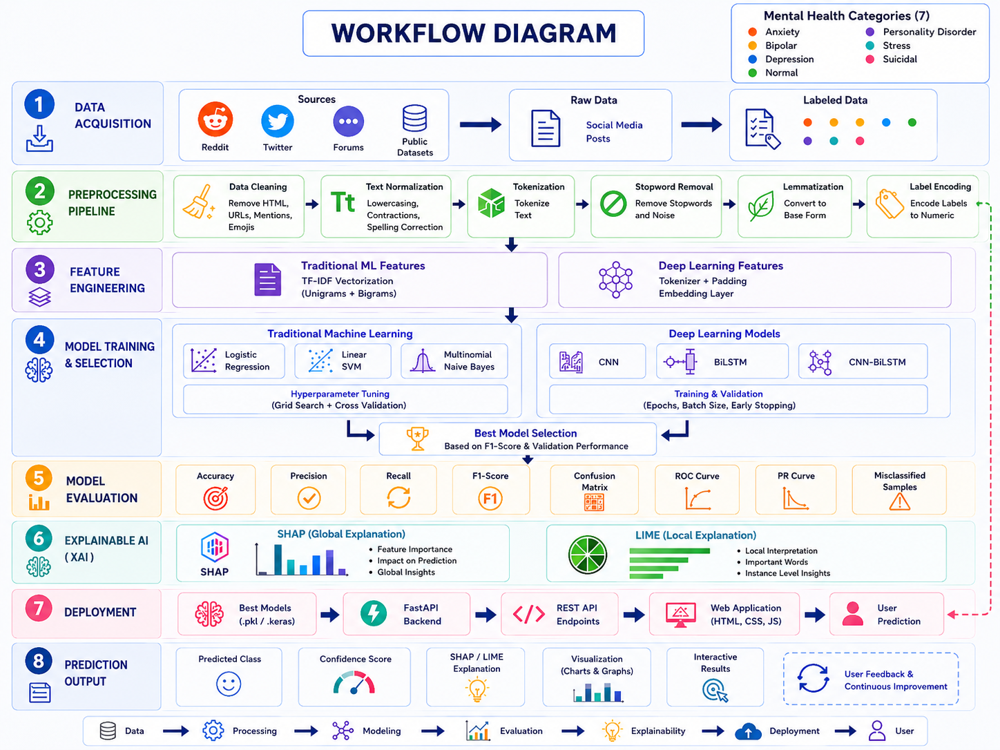
</p>

The workflow consists of the following stages:

1. Dataset Collection
2. Text Preprocessing
3. Feature Engineering
4. Machine Learning Pipeline
5. Deep Learning Pipeline
6. Model Evaluation
7. Explainable AI (SHAP & LIME)
8. FastAPI Deployment
9. Real-Time Mental Health Prediction

---

# 🏗️ System Architecture

The overall architecture of the proposed Explainable AI framework is shown below.

<p align="center">
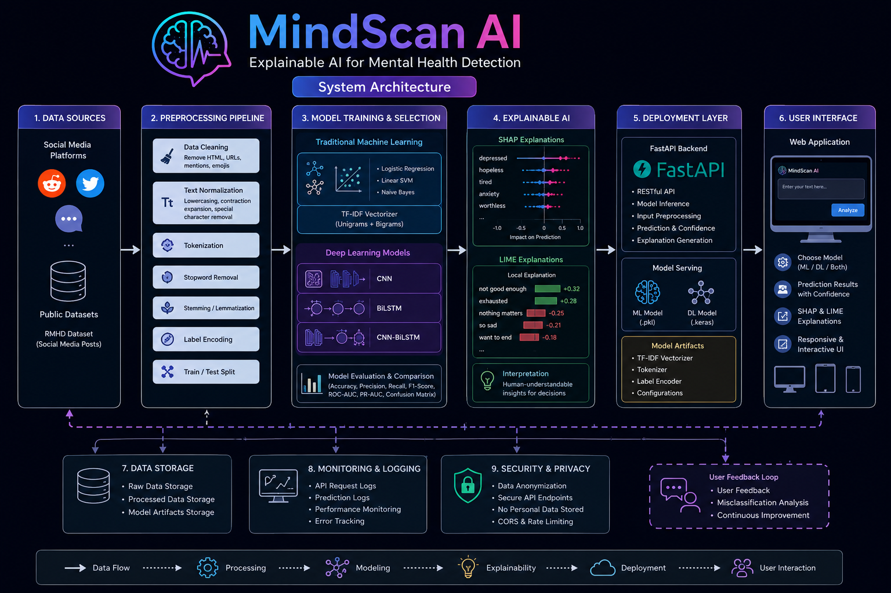
</p>

The architecture integrates data preprocessing, feature engineering, traditional Machine Learning, Deep Learning, Explainable AI, and deployment into a unified end-to-end framework.

---

# ⚙️ End-to-End Pipeline

The complete processing pipeline followed in this project is summarized below.

```text
Social Media Posts
        │
        ▼
Dataset Collection
        │
        ▼
Data Cleaning
        │
        ▼
Text Preprocessing
        │
        ▼
Feature Engineering
        │
 ┌───────────────┐
 │               │
 ▼               ▼
Machine       Deep
Learning     Learning
 │               │
 └───────┬───────┘
         ▼
Performance Evaluation
         ▼
Explainable AI
(SHAP & LIME)
         ▼
FastAPI Deployment
         ▼
Real-Time Prediction
```

---

# 📈 Project Pipeline Overview

The implementation follows an end-to-end Artificial Intelligence workflow:

- 📥 Dataset Acquisition
- 🧹 Text Cleaning & Preprocessing
- 🔤 Feature Engineering
- 🤖 Traditional Machine Learning
- 🧠 Deep Learning
- 📊 Model Evaluation
- 🔍 Explainable AI
- 🌐 FastAPI Web Deployment
- 💬 Mental Health Prediction
- 📱 Interactive User Interface

---
# 🤖 Machine Learning Pipeline

The traditional Machine Learning pipeline transforms textual social media posts into numerical feature vectors using **TF-IDF (Term Frequency–Inverse Document Frequency)** and trains multiple supervised classification algorithms.

The primary objective is to establish strong baseline models for comparison with Deep Learning architectures.

---

## 🛠 Machine Learning Workflow

```text
Input Text
      │
      ▼
Text Cleaning
      │
      ▼
TF-IDF Vectorization
      │
      ▼
Model Training
      │
      ├── Logistic Regression
      ├── Multinomial Naive Bayes
      └── Linear Support Vector Machine
      │
      ▼
Performance Evaluation
```

---

## 📌 Text Preprocessing

Before training, each social media post undergoes multiple preprocessing steps.

- Convert text to lowercase
- Remove HTML tags
- Expand contractions
- Remove URLs
- Remove email addresses
- Remove emojis
- Remove extra whitespace
- Text normalization

These preprocessing steps improve feature quality and reduce noise in the dataset.

---

## 🔤 Feature Engineering

Traditional Machine Learning models use **TF-IDF Vectorization** to convert text into numerical representations.

### TF-IDF Advantages

- Captures important words
- Reduces influence of common words
- Sparse representation
- Computationally efficient
- Excellent baseline for text classification

---

## 🤖 Implemented Machine Learning Models

### Logistic Regression

A probabilistic linear classifier widely used for Natural Language Processing tasks.

**Advantages**

- Fast training
- Interpretable
- High accuracy
- Probability estimation

---

### Multinomial Naive Bayes

A statistical classifier designed specifically for text classification problems.

**Advantages**

- Extremely fast
- Low computational cost
- Works well with TF-IDF
- Strong baseline model

---

### Linear Support Vector Machine (SVM)

A maximum-margin classifier capable of handling high-dimensional text data efficiently.

**Advantages**

- Excellent generalization
- Robust to high-dimensional features
- Effective for sparse datasets

---

# 🧠 Deep Learning Pipeline

Unlike traditional models, Deep Learning automatically learns semantic and contextual information from text.

The project evaluates multiple neural architectures and selects the best-performing model based on classification performance.

---

## 🚀 Deep Learning Workflow

```text
Input Text
      │
      ▼
Text Cleaning
      │
      ▼
Tokenizer
      │
      ▼
Sequence Encoding
      │
      ▼
Padding
      │
      ▼
Embedding Layer
      │
      ▼
Neural Network
      │
 ┌──────────────┐
 │ CNN          │
 │ BiLSTM       │
 │ CNN-BiLSTM   │
 └──────────────┘
      │
      ▼
Softmax Classification
```

---

## 📚 Tokenization

The TensorFlow tokenizer converts textual data into integer sequences.

Example

```text
Input

"I feel hopeless today"

↓

Output

[12, 97, 451, 63]
```

---

## 🔢 Sequence Padding

Since posts have varying lengths, all sequences are padded to a fixed length before training.

Benefits include:

- Uniform input size
- Faster training
- Stable batching
- Better GPU utilization

---

# 🏗 Deep Learning Models

## 1️⃣ Convolutional Neural Network (CNN)

CNN captures local textual patterns by learning phrase-level representations.

### Strengths

- Detects important word combinations
- Fast inference
- Efficient feature extraction

---

## 2️⃣ Bidirectional LSTM (BiLSTM)

BiLSTM processes text in both forward and backward directions, enabling contextual understanding from both sides of a sentence.

### Strengths

- Captures long-term dependencies
- Better contextual representation
- Improved sequential learning

---

## 3️⃣ CNN–BiLSTM (Best Model)

The hybrid CNN–BiLSTM architecture combines the strengths of convolutional feature extraction with bidirectional sequential learning.

### Architecture

```text
Embedding
      │
      ▼
Conv1D
      │
      ▼
MaxPooling
      │
      ▼
Bidirectional LSTM
      │
      ▼
Dropout
      │
      ▼
Dense Layer
      │
      ▼
Softmax
```

### Advantages

- Learns local and global features
- Better contextual understanding
- Reduced overfitting
- Higher classification performance

---

# 📊 Model Evaluation Metrics

All models are evaluated using multiple performance metrics.

| Metric | Purpose |
|---------|----------|
| Accuracy | Overall prediction correctness |
| Precision | Positive prediction quality |
| Recall | Ability to identify positive samples |
| F1 Score | Balance between Precision and Recall |
| ROC Curve | Classification capability |
| Precision–Recall Curve | Performance on imbalanced classes |
| Confusion Matrix | Class-wise prediction analysis |

---

# 🔍 Explainable Artificial Intelligence (XAI)

One of the major contributions of this project is the integration of Explainable AI.

Instead of only predicting a mental health condition, the framework explains **why** the prediction was made.

---

## SHAP (SHapley Additive Explanations)

SHAP measures the contribution of each feature toward the final prediction.

### SHAP provides

- Global model interpretability
- Local prediction explanations
- Feature importance ranking
- Positive and negative feature contributions

---

## LIME (Local Interpretable Model-Agnostic Explanations)

LIME approximates the behavior of the model around an individual prediction.

### LIME provides

- Local explanations
- Human-readable interpretations
- Important words influencing predictions
- Trustworthy prediction analysis

---

# 💡 Why Explainability Matters

Mental health prediction is a sensitive application where transparency is essential.

By incorporating SHAP and LIME, this framework enables:

- 🔍 Transparent predictions
- 🧠 Human-understandable explanations
- 📊 Feature importance visualization
- 🤝 Increased trust in AI systems
- 📚 Better research reproducibility
- ⚖️ Responsible AI practices

This combination of predictive performance and interpretability makes the framework suitable for academic research, educational purposes, and future clinical decision-support research.

---
# ⚙️ Installation

Follow the steps below to set up and run the project on your local machine.

---

## 📋 Prerequisites

Make sure you have the following installed before proceeding.

| Software | Version |
|----------|----------|
| Python | 3.10 or later |
| Git | Latest |
| pip | Latest |

---

# 📥 Clone the Repository

```bash
git clone https://github.com/Bijoy781999/Explainable-AI-for-Detecting-Mental-Health-Condition.git

cd Explainable-AI-for-Detecting-Mental-Health-Condition
```

---

# 📦 Install Dependencies

## Project Dependencies

```bash
pip install -r requirements.txt
```

## FastAPI Application Dependencies

```bash
pip install -r app/requirements.txt
```

---

# 📂 Dataset Setup

The complete dataset is **not included** in this repository.

Download the dataset from Kaggle:

https://www.kaggle.com/datasets/suchintikasarkar/sentiment-analysis-for-mental-health

After downloading, place the dataset as shown below.

```text
dataset/
├── Combined Data.csv
└── sample_Combined_Data.csv
```

> **Note**
>
> A sample dataset containing **2,000 rows** is already included for testing purposes.

---

# 🤖 Download Deep Learning Model

The trained CNN–BiLSTM model is excluded from the repository because it exceeds GitHub's file size recommendations.

Download the model from the provided link and place it inside:

```text
saved_models/
│
├── best_dl_model.keras
├── best_ml_model.pkl
├── tokenizer.pkl
├── tfidf_vectorizer.pkl
├── label_encoder.pkl
├── config.pkl
└── dl_config.pkl
```

---

# 🚀 Running the Web Application

Navigate to the application directory.

```bash
cd app
```

Start the FastAPI server.

```bash
python main.py
```

or

```bash
uvicorn main:app --reload
```

---

# 🌐 Open the Application

After the server starts successfully, open your browser and visit:

```text
http://127.0.0.1:8000
```

You should see the **Explainable AI Mental Health Detection** dashboard.

---

# 💬 Using the Application

## Step 1

Launch the FastAPI server.

---

## Step 2

Open the web application in your browser.

---

## Step 3

Paste a social media post into the input box.

Example

```text
I feel exhausted lately and nothing seems to make me happy anymore.
```

---

## Step 4

Select one of the prediction modes.

- Traditional Machine Learning
- Deep Learning
- Compare Both Models

---

## Step 5

Click

```text
Analyze
```

---

## Step 6

The application returns:

- Predicted Mental Health Condition
- Confidence Score
- Model Used

---

# 🧠 Supported Prediction Classes

The application predicts one of the following classes.

| Class |
|--------|
| Anxiety |
| Bipolar |
| Depression |
| Normal |
| Personality Disorder |
| Stress |
| Suicidal |

---

# 📊 Running the Notebook

To reproduce the complete research pipeline, open the notebook.

```text
notebooks/
└── explainable-ai-for-mental-health-detection.ipynb
```

Run all notebook cells sequentially.

The notebook includes:

- Data Loading
- Data Preprocessing
- Exploratory Data Analysis
- Machine Learning
- Deep Learning
- Model Evaluation
- Explainable AI (SHAP)
- Explainable AI (LIME)
- Model Saving

---

# 💾 Saved Models

The project stores the following artifacts after training.

```text
saved_models/
│
├── best_ml_model.pkl
├── best_dl_model.keras
├── tokenizer.pkl
├── tfidf_vectorizer.pkl
├── label_encoder.pkl
├── config.pkl
└── dl_config.pkl
```

These files are automatically loaded by the FastAPI application during inference.

---

# 📁 Important Repository Folders

| Folder | Purpose |
|---------|----------|
| app | FastAPI web application |
| notebooks | Complete training notebook |
| dataset | Sample dataset and documentation |
| saved_models | Trained model artifacts |
| results | Performance evaluation figures |
| screenshots | Web application screenshots |
| diagrams | Workflow and architecture diagrams |
| assets | Banner and project logo |

---

# ⚠️ Disclaimer

This project is intended **solely for research, educational, and demonstration purposes**.

The predictions generated by this system **must not** be interpreted as medical diagnoses or professional mental health assessments.

If you or someone you know is experiencing mental health difficulties, please consult a qualified mental health professional or appropriate healthcare provider.

---
# 🌐 Web Application

The project includes a modern **FastAPI-powered web application** that enables users to perform real-time mental health prediction using both **Machine Learning** and **Deep Learning** models.

Users can:

- 📝 Analyze social media posts
- 🤖 Predict using Machine Learning
- 🧠 Predict using Deep Learning
- ⚖️ Compare both models simultaneously
- 📊 View prediction confidence
- 🔍 Visualize Explainable AI (SHAP & LIME)

---

# 📸 Application Preview

## 🏠 Home Dashboard

The landing page provides an intuitive interface for entering social media text and selecting the prediction model.

<p align="center">
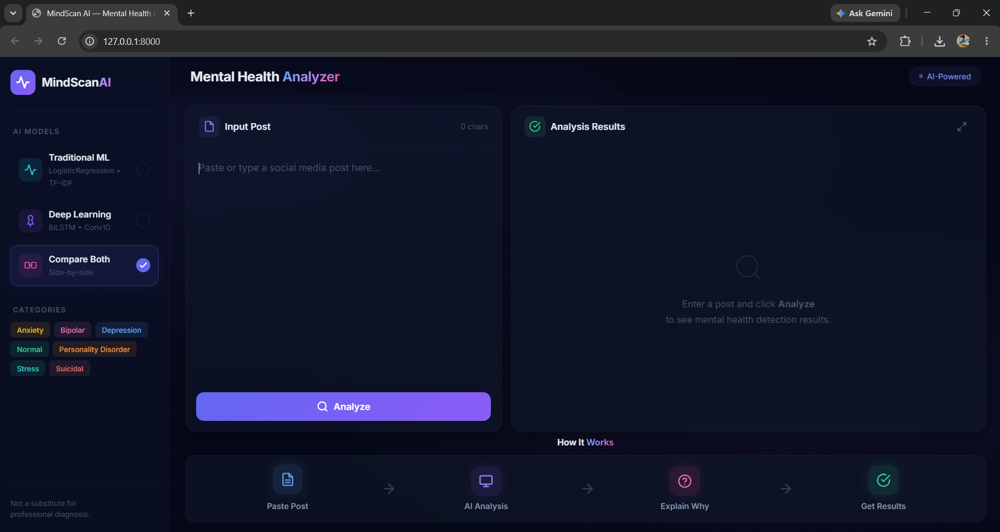
</p>

---

## 📊 Prediction Results

The application displays the predicted mental health condition together with the confidence score.

<p align="center">
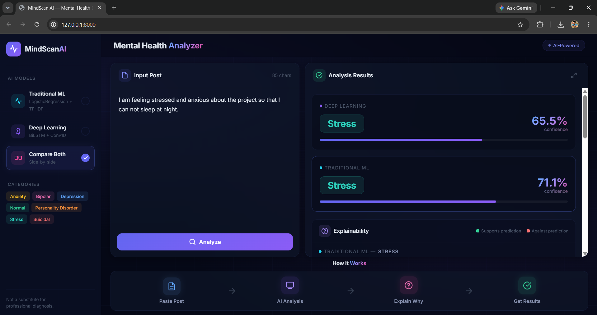
</p>

---

## 🔍 LIME Explanation

The LIME explanation interface highlights the most influential words contributing to the prediction.

<p align="center">
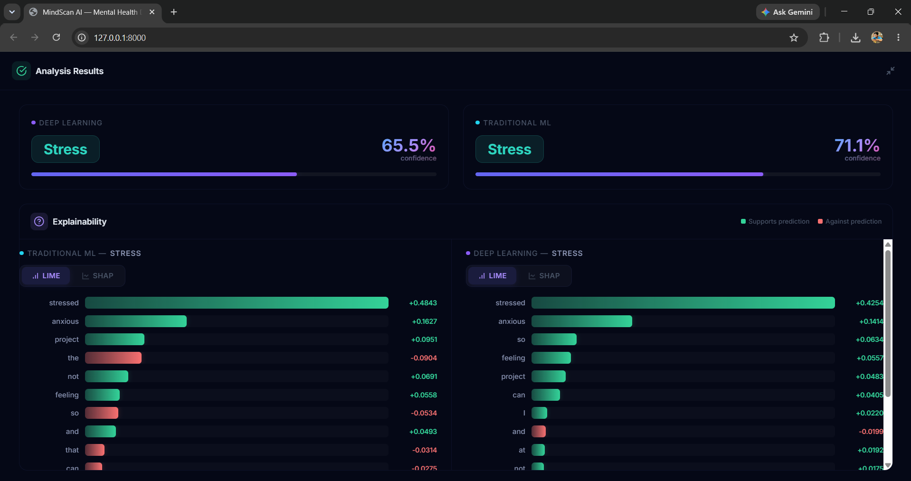
</p>

---

## 🧠 SHAP Explanation

SHAP visualizes the contribution of each feature toward the final prediction.

<p align="center">
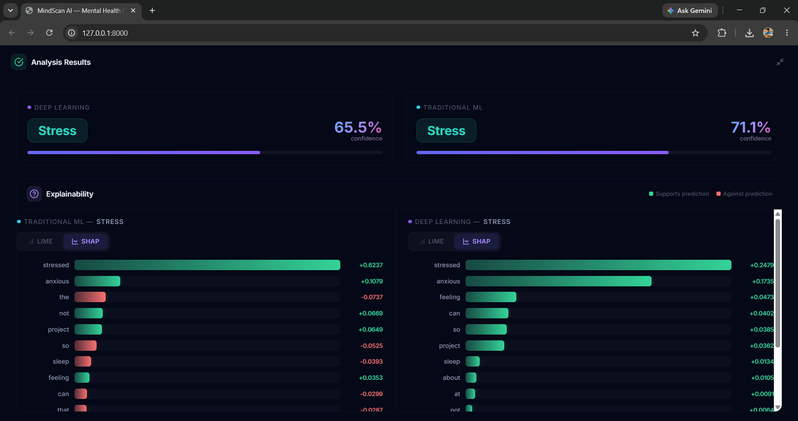
</p>

---

## 📱 Mobile Interface

The web application is fully responsive and optimized for mobile devices.

<p align="center">
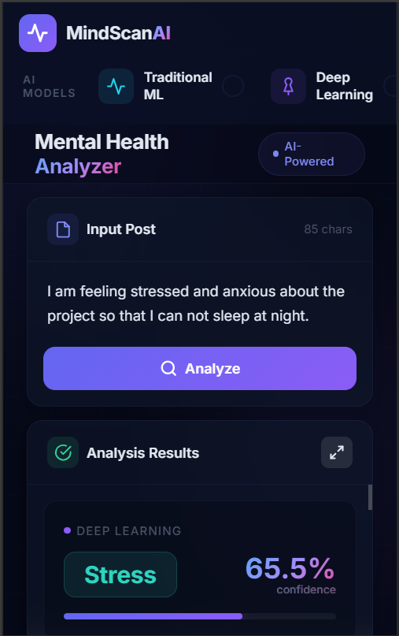
</p>

---

# 📈 Experimental Results

The framework evaluates both traditional Machine Learning and Deep Learning models using multiple evaluation metrics.

The following metrics are reported:

- Accuracy
- Precision
- Recall
- F1-Score
- ROC Curve
- Precision–Recall Curve
- Confusion Matrix
- Per-Class Accuracy

---

# 🤖 Traditional Machine Learning Performance

Performance comparison of the implemented Machine Learning models.

<p align="center">
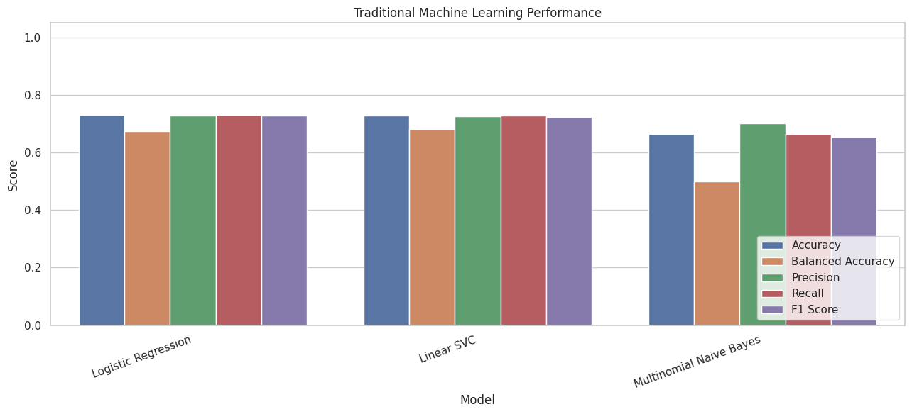
</p>

---

## Logistic Regression Confusion Matrix

<p align="center">
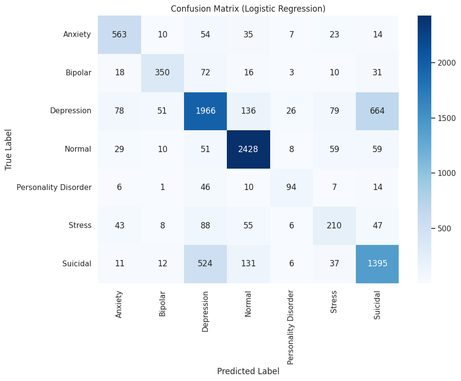
</p>

---

## Logistic Regression ROC Curve

<p align="center">
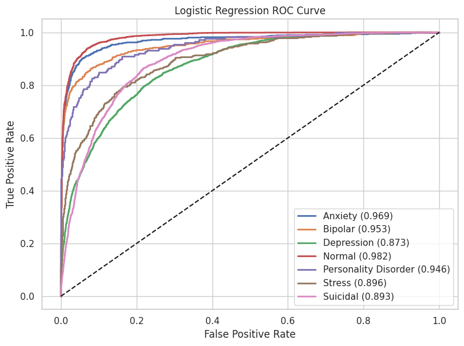
</p>

---

## Logistic Regression Precision–Recall Curve

<p align="center">
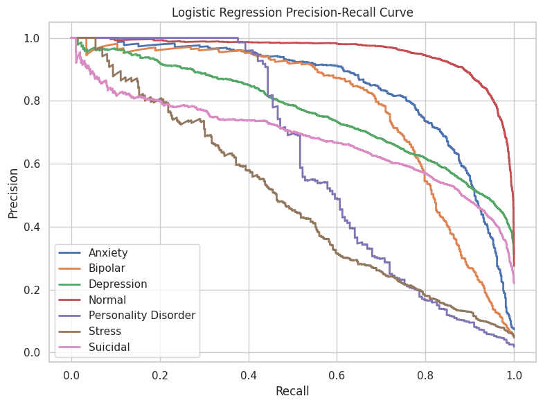
</p>

---

## Logistic Regression Per-Class Accuracy

<p align="center">
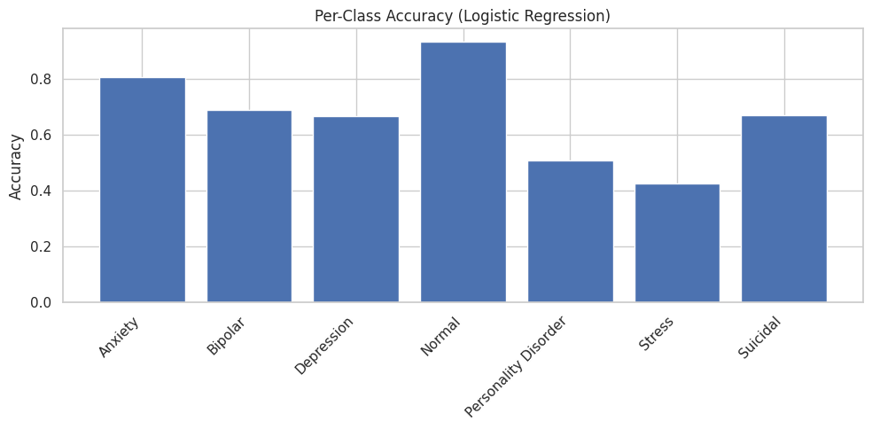
</p>

---

# 🧠 Deep Learning Performance

Comparison of the implemented Deep Learning models.

<p align="center">
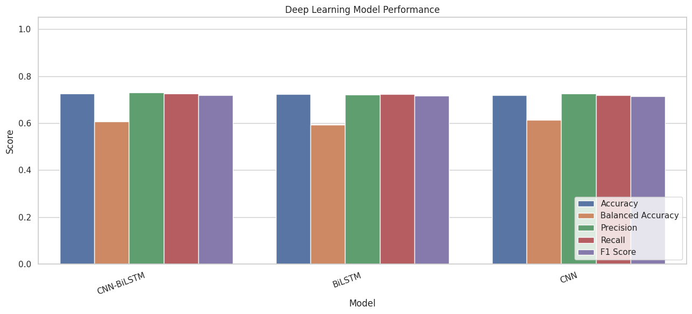
</p>

---

## CNN–BiLSTM Confusion Matrix

<p align="center">
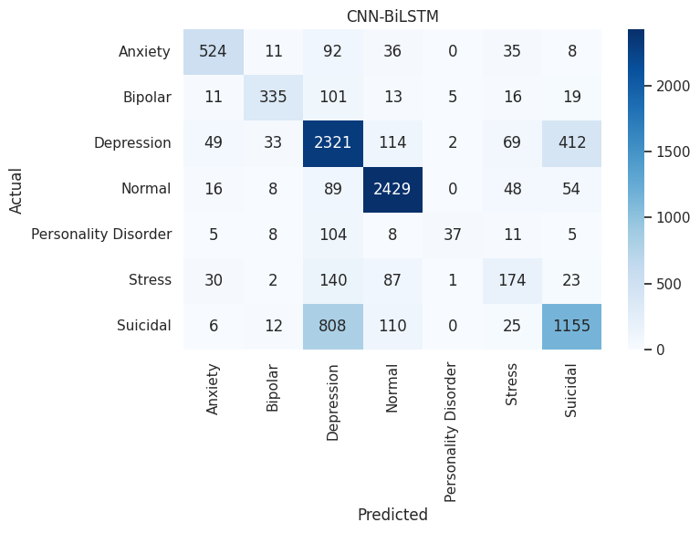
</p>

---

## CNN–BiLSTM ROC Curve

<p align="center">
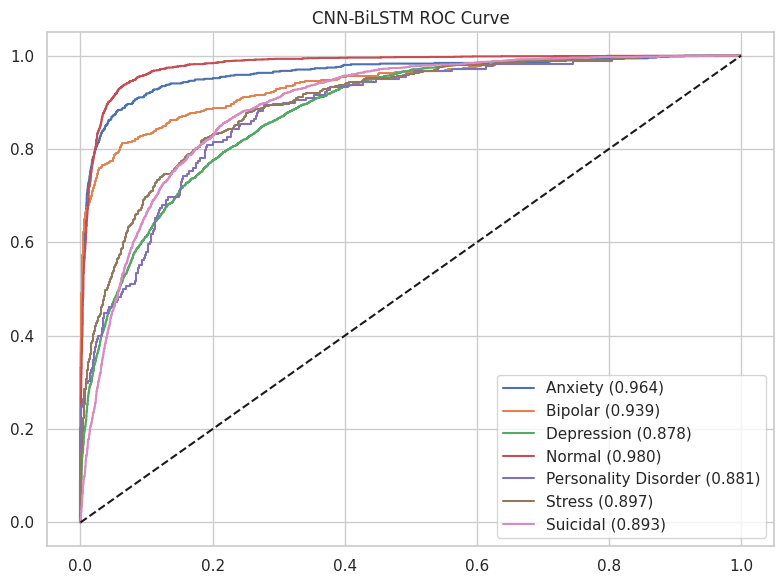
</p>

---

## CNN–BiLSTM Precision–Recall Curve

<p align="center">
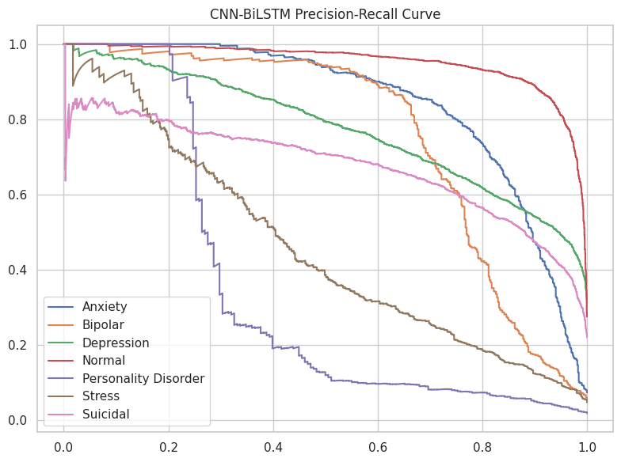
</p>

---

# 🏆 Summary of Results

The experimental evaluation demonstrates that both Machine Learning and Deep Learning models achieve competitive performance for multi-class mental health detection.

### Traditional Machine Learning

- Fast training and inference
- Efficient TF-IDF representation
- Strong baseline performance
- Low computational requirements

---

### Deep Learning

- Superior contextual understanding
- Better semantic feature extraction
- Higher overall classification performance
- More robust on complex textual patterns

---

### Explainable AI

The integration of **SHAP** and **LIME** enables transparent and interpretable predictions by highlighting the textual features responsible for each prediction.

This enhances:

- Model transparency
- User trust
- Explainability
- Research reproducibility
- Responsible AI deployment

---
# 🔍 Explainable Artificial Intelligence (XAI)

One of the key contributions of this project is the integration of **Explainable Artificial Intelligence (XAI)** techniques. Rather than functioning as a black-box classifier, the framework provides transparent explanations for every prediction.

Two complementary explainability methods are implemented:

- **SHAP (SHapley Additive exPlanations)**
- **LIME (Local Interpretable Model-agnostic Explanations)**

These techniques help identify the words that contribute positively or negatively to the predicted mental health condition.

---

# 🧠 SHAP Explanations

SHAP explains model predictions using **Shapley values**, assigning each feature a contribution score based on cooperative game theory.

### SHAP provides

- Global model interpretability
- Local prediction explanations
- Feature importance ranking
- Positive feature contributions
- Negative feature contributions
- Transparent decision making

---

## SHAP Explanation Examples

### Example 1

<p align="center">
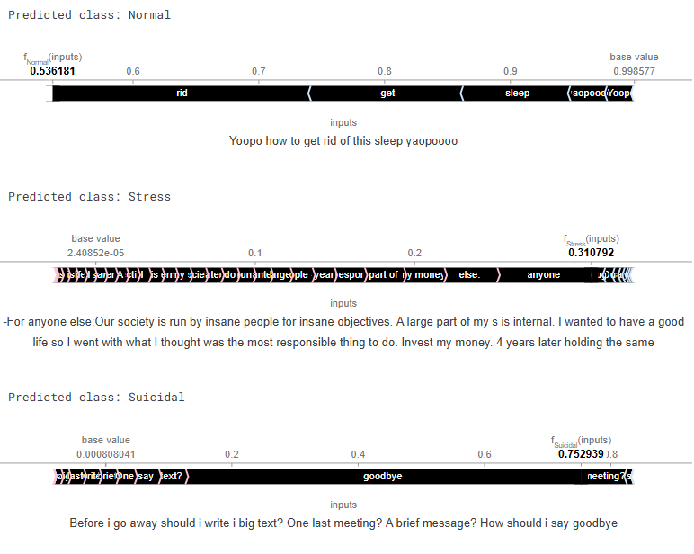
</p>

---

### Example 2

<p align="center">
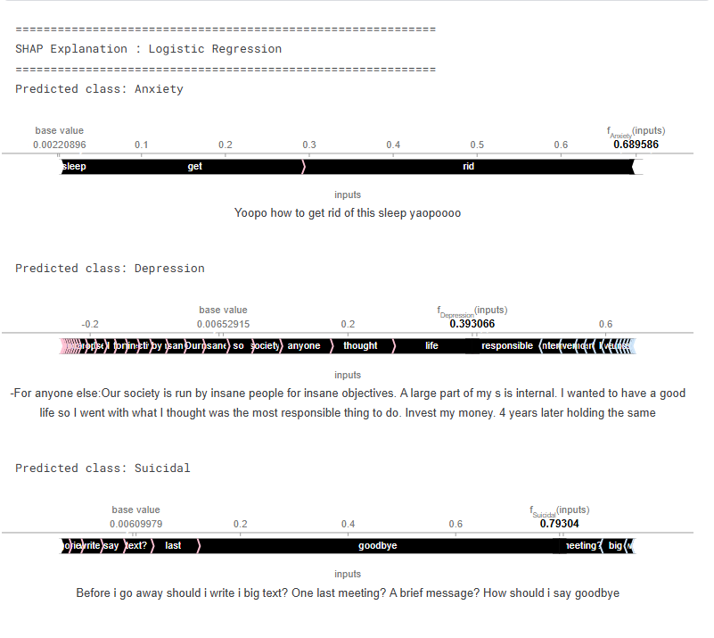
</p>

---

# 💡 Interpreting SHAP Results

- 🔴 Positive SHAP values increase the probability of the predicted class.
- 🔵 Negative SHAP values decrease the probability of the predicted class.
- Longer bars indicate a stronger influence on the model's decision.
- Words with larger contributions have greater impact on the final prediction.

---

# 🔎 LIME Explanations

LIME generates local surrogate models to explain individual predictions, making it easier to understand why a specific text was classified into a particular mental health category.

### LIME provides

- Local interpretability
- Human-readable explanations
- Important word visualization
- Prediction confidence analysis
- Feature contribution analysis

---

## LIME Explanation Examples

### Example 1

<p align="center">
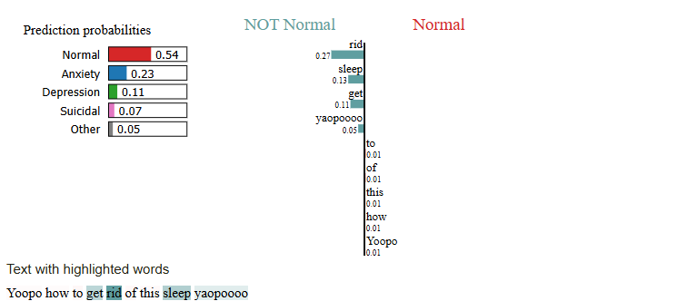
</p>

---

### Example 2

<p align="center">
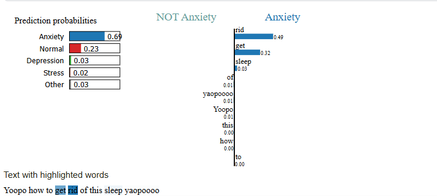
</p>

---

# 📊 SHAP vs LIME

| Feature | SHAP | LIME |
|---------|------|------|
| Global Interpretability | ✅ | ❌ |
| Local Interpretability | ✅ | ✅ |
| Feature Importance | ✅ | ✅ |
| Individual Prediction Explanation | ✅ | ✅ |
| Consistent Explanations | ✅ | ❌ |
| Model Agnostic | ✅ | ✅ |

---

# 🌟 Advantages of Explainable AI

The integration of SHAP and LIME provides several important benefits:

- 🔍 Transparent predictions
- 🧠 Human-understandable explanations
- 🤝 Increased trust in AI systems
- ⚖️ Responsible AI development
- 📊 Better feature interpretation
- 🛡️ Improved model validation
- 📚 Enhanced research reproducibility

---

# 🚧 Current Limitations

Although the proposed framework demonstrates strong performance, several limitations remain:

- The model is trained on English-language social media posts only.
- Predictions depend on the quality and diversity of the training dataset.
- The framework is designed for research and educational purposes rather than clinical diagnosis.
- Mental health conditions are complex and cannot be determined solely from textual content.
- Performance may vary for unseen writing styles or domain-specific language.

---

# 🚀 Future Enhancements

Potential directions for future work include:

- 🌍 Multilingual mental health detection
- 🤖 Transformer-based models (BERT, RoBERTa, DeBERTa)
- 🧠 Large Language Model (LLM) integration
- 📱 Android and iOS applications
- ☁️ Cloud deployment
- 🔊 Voice and speech-based mental health analysis
- 😊 Multimodal learning using text, audio, and images
- 📈 Continual learning with new datasets
- 🌐 Real-time social media monitoring
- 🏥 Integration with clinical decision-support systems

---

# ⚠️ Ethical Considerations

This project is intended **solely for research, educational, and demonstration purposes**.

The predictions generated by this framework:

- ❌ Are **not** medical diagnoses.
- ❌ Should **not** replace professional mental health assessment.
- ❌ Must **not** be used as the sole basis for clinical decision-making.

The framework is designed to support AI research and demonstrate the application of Explainable AI in mental health text classification.

---

# 🎯 Project Achievements

This project successfully combines:

- ✅ Traditional Machine Learning
- ✅ Deep Learning
- ✅ Explainable AI
- ✅ Natural Language Processing
- ✅ FastAPI Deployment
- ✅ Interactive Web Application

into a single end-to-end framework for multi-class mental health detection from social media posts.

The combination of predictive performance and model interpretability makes this project a comprehensive demonstration of responsible AI for text classification.

---
# 🤝 Contributing

Contributions are welcome and greatly appreciated!

If you would like to improve this project, please follow these steps:

1. Fork the repository.
2. Create a new feature branch.

```bash
git checkout -b feature/your-feature-name
```

3. Commit your changes.

```bash
git commit -m "Add: Your Feature"
```

4. Push your branch.

```bash
git push origin feature/your-feature-name
```

5. Open a Pull Request.

Please ensure that your code follows the project's coding standards and includes appropriate documentation where necessary.

---

# 🛣️ Project Roadmap

Future improvements planned for this project include:

- [ ] Transformer-based Models (BERT, RoBERTa, DeBERTa)
- [ ] Large Language Model (LLM) Integration
- [ ] Multilingual Mental Health Detection
- [ ] Speech-Based Mental Health Analysis
- [ ] Mobile Application (Android & iOS)
- [ ] Docker Containerization
- [ ] Cloud Deployment
- [ ] REST API Documentation
- [ ] User Authentication
- [ ] Real-Time Social Media Monitoring
- [ ] Model Versioning
- [ ] CI/CD Integration

---

# 📜 License

This project is licensed under the **MIT License**.

See the **LICENSE** file for complete details.

---

# 📖 Citation

If you use this project in your research or academic work, please consider citing it.

```bibtex
@software{bhadra2026explainable,
  author       = {Bijoy Bhadra},
  title        = {Explainable AI for Detecting Mental Health Condition},
  year         = {2026},
  publisher    = {GitHub},
  url          = {https://github.com/Bijoy781999/Explainable-AI-for-Detecting-Mental-Health-Condition}
}
```

---

# 🙏 Acknowledgements

This project was developed using several outstanding open-source libraries and frameworks.

Special thanks to:

- TensorFlow
- Scikit-learn
- FastAPI
- SHAP
- LIME
- Pandas
- NumPy
- Matplotlib
- BeautifulSoup
- Kaggle
- Python Open Source Community

Their contributions made this research and implementation possible.

---

# 👨‍💻 Author

<div align="center">

## Bijoy Bhadra

AI • Machine Learning • Deep Learning • Natural Language Processing • Explainable AI

</div>

### Connect with me

<p align="left">

<a href="https://github.com/Bijoy781999">

</a>

<a href="https://www.linkedin.com/in/bijoy-bhadra-5941bb370">

</a>

<a href="https://www.kaggle.com/bijoybhadra">

</a>

<a href="https://huggingface.co/BijoyB78">

</a>

<a href="mailto:bijoy.bhadra222@gmail.com">

</a>

</p>

---

# ⭐ Support the Project

If you found this project useful, please consider:

⭐ Starring this repository

🍴 Forking the repository

📢 Sharing it with others

🤝 Contributing to future improvements

Your support helps improve the project and encourages continued development.

---

<div align="center">

## ⭐ If you like this project, don't forget to leave a star! ⭐

**Thank you for visiting this repository.**

Made with ❤️ by **Bijoy Bhadra**

</div>
